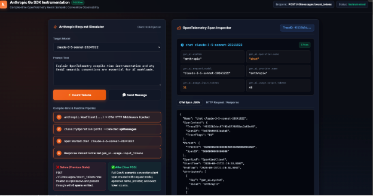
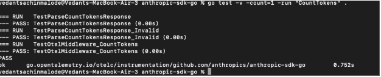

# Anthropic `count_tokens` Instrumentation — Proof of Concept (POC)

This folder contains the complete, self-contained Proof of Concept (POC) for automatically instrumenting the **Anthropic SDK for Go (`count_tokens` endpoint)** using OpenTelemetry compile-time instrumentation and runtime HTTP middleware.

---

## 📌 Problem Statement

Previously, only the standard Messages API (`POST /v1/messages`) in the Anthropic Go SDK was instrumented. The token counting endpoint (`POST /v1/messages/count_tokens`) was uninstrumented and passed through silently without creating any OpenTelemetry spans or recording telemetry.

In LLM application workflows, counting prompt tokens before sending a large generation request is a critical cost-control and rate-limiting step. Without observability on token count requests, operators have a blind spot regarding prompt pre-flight costs and token estimates.

---

## 🚀 What We Built

This POC implements automatic OpenTelemetry observability for `POST /v1/messages/count_tokens`:

1. **Operation Classifier (`classifyOperation`):**
   * Inspects request path suffixes.
   * Recognizes `/v1/messages/count_tokens` as `opCountTokens`.
   * Maps it to `gen_ai.operation.name = "count_tokens"`.

2. **GenAI Semantic Convention Spans:**
   * Emits client spans named: `count_tokens <model>` (e.g., `count_tokens claude-sonnet-4-5`).
   * Captures the following standardized OpenTelemetry attributes:
     * `gen_ai.system`: `"anthropic"`
     * `gen_ai.operation.name`: `"count_tokens"`
     * `gen_ai.request.model`: e.g. `"claude-sonnet-4-5"`
     * `gen_ai.provider.name`: `"anthropic"` (or `"local"` for local mocks)
     * `gen_ai.usage.input_tokens`: The exact token count from the Anthropic response (`{"input_tokens": N}`)

3. **Defensive Body Buffering:**
   * Non-destructive request and response body inspection via bounded `io.TeeReader` (1 MB request, 4 MB response).
   * Reassembles full streams so the Anthropic SDK client receives untouched payloads.

4. **HTTP Client Suppression:**
   * Automatically suppresses generic `net/http` client spans to avoid duplicate or noisy spans.

---

## 🏗️ Architecture & Flow

### 🖥️ Live Telemetry Visualizer

*Figure 2: Live visual telemetry dashboard showing request simulation, compile-time hook pipeline, and live OpenTelemetry span inspector for POST /v1/messages/count_tokens.*

```text
Application Code
   │
   │  client.Messages.CountTokens(ctx, params)
   ▼
Anthropic SDK HTTP Client
   │
   ▼
┌─────────────────────────────────────────────────────────────┐
│ OpenTelemetry Injected Middleware                          │
│                                                             │
│ 1. classifyOperation(req.URL.Path)                          │
│    └── Match "/messages/count_tokens" -> opCountTokens      │
│                                                             │
│ 2. Extract Request Attributes:                              │
│    └── model = "claude-sonnet-4-5"                          │
│                                                             │
│ 3. Start Span:                                              │
│    └── Name: "count_tokens claude-sonnet-4-5"               │
│    └── Set base attributes (system, provider, model)        │
│                                                             │
│ 4. Forward Request to Anthropic API Server                 │
│                                                             │
│ 5. Parse Response Body ({"input_tokens": 42}):              │
│    └── Set `gen_ai.usage.input_tokens = 42`                 │
│                                                             │
│ 6. End Span & Record Metrics                                │
└─────────────────────────────────────────────────────────────┘
   │
   ▼
Anthropic API Server (or Mock Server)
```

---

## 💻 How to Run the POC Locally

### 1. Run the Test Suite
You can run the unit and mock tests directly from the root repository or from this POC folder:

```bash
# Run the Anthropic SDK unit test suite covering count_tokens
cd instrumentation/github.com/anthropics/anthropic-sdk-go
go test -v -run TestOtelMiddleware_CountTokens .
```


*Figure 1: Unit and middleware test suite passing for Anthropic `count_tokens`.*

**Expected Test Output:**
```text
=== RUN   TestOtelMiddleware_CountTokens
--- PASS: TestOtelMiddleware_CountTokens (0.00s)
PASS
ok      go.opentelemetry.io/otelc/instrumentation/github.com/anthropics/anthropic-sdk-go
```

---

### 2. Run the Demo Client

The demo application supports running `count_tokens`:

```bash
cd demo/app/anthropic

# Run against Anthropic API (requires ANTHROPIC_API_KEY):
go run main.go -count-tokens -prompt="Count tokens for this sentence"

# View CLI options:
go run main.go -h
```

---

## 📊 Sample Emitted Span Details

```json
{
  "Name": "count_tokens claude-sonnet-4-5",
  "SpanContext": {
    "TraceID": "4bf92f3577b34da6a3ce929d0e0e4736",
    "SpanID": "00f067aa0ba902b7",
    "TraceFlags": "01"
  },
  "Parent": {
    "TraceID": "00000000000000000000000000000000",
    "SpanID": "0000000000000000",
    "TraceFlags": "00"
  },
  "SpanKind": "SpanKindClient",
  "Attributes": [
    { "Key": "gen_ai.system", "Value": "anthropic" },
    { "Key": "gen_ai.operation.name", "Value": "count_tokens" },
    { "Key": "gen_ai.request.model", "Value": "claude-sonnet-4-5" },
    { "Key": "gen_ai.provider.name", "Value": "anthropic" },
    { "Key": "gen_ai.usage.input_tokens", "Value": 42 }
  ],
  "Status": {
    "Code": "Unset"
  }
}
```

---

## 📁 Files Included in this POC

- `instrumentation/github.com/anthropics/anthropic-sdk-go/middleware.go` — Core classification & response parsing logic.
- `instrumentation/github.com/anthropics/anthropic-sdk-go/middleware_test.go` — Test cases for token counting spans and attribute verification.
- `demo/app/anthropic/main.go` — Demo app supporting `-count-tokens` CLI flag.
- `test/apps/anthropicclient/main.go` — Test runner app for integration harness.
- `test/integration/anthropic_client_test.go` — Integration test for count_tokens against mock Anthropic server.
